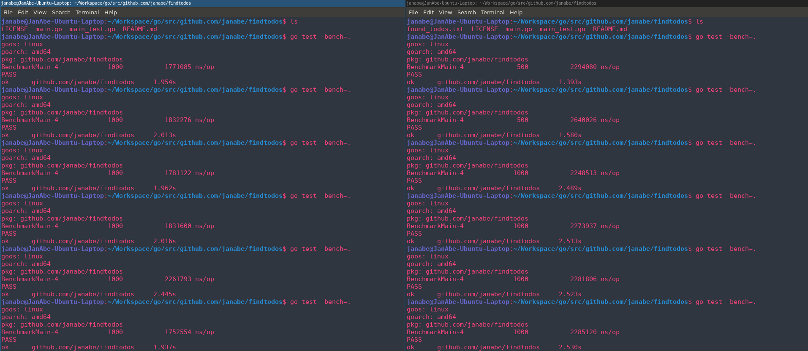

# Findtodos

#### Usage
findtodos -directory=... -extension=... -output=...
> -directory string
 > This flag is used to specify which directory should be scanned. (default ".")

> -extension string
> This flag is used to specify the extension type the program should look for. (default ".go")

> -output string
> This flag is used to specify the output location of the found todo's. (default "./found_todos.txt")

###### Example
`findtodos -directory=/home/user/workspace/project -extension=.go -output=/home/user/Documents/findtodos_output.txt`

#### Benchmark
Results of multiple benchmark tests.
The left screen contains the results of the execution of the current program (after the concurrent changes).
The right screen contains the results of the execution of the program before the changes, so being lineair.

As you can see, the change to make it concurrent has resulted in a performance boost 

#### Why
Just wanted to make a small program in Go, and to easily find all todo's in a project.

#### Todo:
Improve finding todo's, atm it's kinda shitty :c
Refactor code